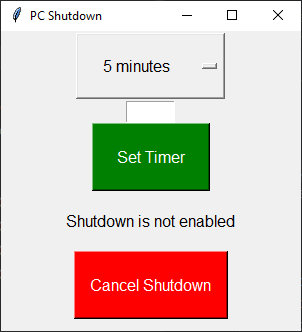

#  PC Shutdown

A simple GUI in Tkinter for setting a PC shutdown timer.
You can manually enter the number of minutes for the timer, or select one form the dropdown menu.
For the dropdown menu to be selected, leave the text field empty.
The shutdown is set using the Command Prompt.

## Screenshot

## Requirements

* tkinter
